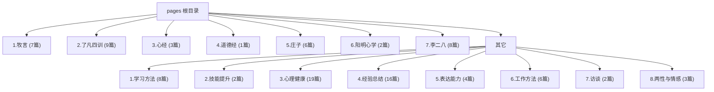

# CLAUDE.md

This file provides guidance to Claude Code (claude.ai/code) when working with code in this repository.

## 变更记录 (Changelog)

- **2025-11-09**: 完整分析代码库结构，更新模块结构图和详细技术架构文档
- **2025-10-12**: 初始版本，建立基础项目文档结构

## 项目概述

这是一个包含个人成长和哲学文章的静态网站集合，内容全部使用中文编写。项目包含 107+ 个 HTML 文件，按照主题分类组织，涵盖哲学、心理学、自我提升和传统智慧等主题。

该项目是一个纯静态网站，专注于中文内容的知识传播，采用现代化的响应式设计和交互体验。

## 项目愿景

建立一个高质量的个人成长和哲学智慧内容库，通过现代化的网页设计和优秀的用户体验，为中文读者提供深度的思考和实用的生活指导。

## 架构总览



## 模块索引

| 模块路径 | 文章数量 | 主题内容 | 状态 |
|---------|---------|---------|------|
| `1.牧言` | 7篇 | 个人智慧和现代哲学思想 | ✅ 完整 |
| `2.了凡四训` | 9篇 | 古典智慧与自我重塑 | ✅ 完整 |
| `3.心经` | 3篇 | 佛学哲学与内心成长 | ✅ 完整 |
| `4.道德经` | 1篇 | 道家思想精髓 | ✅ 完整 |
| `5.庄子` | 6篇 | 庄子哲学与人生智慧 | ✅ 完整 |
| `6.阳明心学` | 2篇 | 王阳明心学思想 | ✅ 完整 |
| `7.李二八` | 8篇 | 现代实用智慧 | ✅ 完整 |
| `其它/1.学习方法` | 8篇 | 学习策略与技巧 | ✅ 完整 |
| `其它/2.技能提升` | 2篇 | 职场技能发展 | ✅ 完整 |
| `其它/3.心理健康` | 19篇 | 心理学与情绪管理 | ✅ 完整 |
| `其它/4.经验总结` | 16篇 | 人生经验与反思 | ✅ 完整 |
| `其它/5.表达能力` | 4篇 | 沟通技巧与表达 | ✅ 完整 |
| `其它/6.工作方法` | 6篇 | 职场工作策略 | ✅ 完整 |
| `其它/7.访谈` | 2篇 | 对话与访谈内容 | ✅ 完整 |
| `其它/8.两性与情感` | 3篇 | 情感关系指导 | ✅ 完整 |

## 技术架构

### 核心技术栈

- **HTML5**: 语义化标记，现代网页结构
- **Tailwind CSS**: 通过 CDN 引入的实用优先的 CSS 框架
- **JavaScript**: 原生 JavaScript，包含 Intersection Observer API
- **Framer Motion**: 动画库 (通过 CDN 引入)
- **Material Icons**: 图标库 (Google Fonts)

### 设计系统

#### 色彩主题
- **主色调**: `#6366f1` (Indigo)
- **辅助色**: `#8b5cf6` (Purple)
- **强调色**: `#0ea5e9` (Sky Blue)
- **背景色**: 渐变背景，从深紫到深蓝
- **文字色**: 适配深色背景的浅色文字

#### 响应式断点
- **移动端**: 480px 以下
- **平板端**: 768px 以下
- **桌面端**: 1200px 以上

#### 布局特性
- CSS Grid 用于复杂布局 (bento-grid 系统)
- Flexbox 用于灵活布局
- 移动优先的响应式设计
- 流体网格系统

### JavaScript 功能特性

- **滚动动画**: Intersection Observer API
- **动态进度条**: 实时更新的交互元素
- **平滑滚动导航**: 导航功能
- **移动端菜单**: 响应式汉堡菜单
- **波浪动画**: 视觉效果增强
- **动态内容加载**: 懒加载大内容区域

## 文件结构

```
pages/
├── index.html                  # 主导航页面 (现代网页设计)
├── CLAUDE.md                   # 项目文档 (本文件)
├── file_counter.ps1           # PowerShell 文件统计脚本
├── 文件统计结果.txt             # 自动生成的统计报告
├── 1.牧言/                     # 个人智慧模块 (7个HTML文件)
├── 2.了凡四训/                  # 古典智慧模块 (9个HTML文件)
├── 3.心经/                     # 佛学哲学模块 (3个HTML文件)
├── 4.道德经/                   # 道家思想模块 (1个HTML文件)
├── 5.庄子/                     # 庄子哲学模块 (6个HTML文件)
├── 6.阳明心学/                  # 心学思想模块 (2个HTML文件)
├── 7.李二八/                   # 现代智慧模块 (8个HTML文件)
└── 其它/                       # 其他主题模块 (58个HTML文件)
    ├── 1.学习方法/              # 学习策略 (8个文件)
    ├── 2.技能提升/              # 技能发展 (2个文件)
    ├── 3.心理健康/              # 心理健康 (19个文件)
    ├── 4.经验总结/              # 人生经验 (16个文件)
    ├── 5.表达能力/              # 沟通技巧 (4个文件)
    ├── 6.工作方法/              # 工作策略 (6个文件)
    ├── 7.访谈/                  # 访谈内容 (2个文件)
    └── 8.两性与情感/            # 情感关系 (3个文件)
```

## 运行与开发

### 本地开发

1. **启动本地服务器**
   ```bash
   # 使用 Python 3
   python -m http.server 8000

   # 或使用 Node.js
   npx serve .

   # 或使用 Live Server 扩展 (VS Code)
   ```

2. **访问网站**
   ```
   http://localhost:8000
   ```

### 文件统计与管理

```bash
# PowerShell 环境下运行文件统计
.\file_counter.ps1

# 查看统计结果
Get-Content .\文件统计结果.txt
```

### 内容更新流程

1. 创建新 HTML 文件
2. 放入对应的主题分类文件夹
3. 遵循现有文件命名模式
4. 更新 `index.html` 添加新文章链接
5. 运行统计脚本更新文件计数

## 测试策略

### 多浏览器兼容性测试
- Chrome (推荐)
- Firefox
- Safari
- Edge

### 响应式设计测试
- 移动设备 (320px - 767px)
- 平板设备 (768px - 1199px)
- 桌面设备 (1200px+)

### 功能性测试
- 导航菜单响应
- 滚动动画效果
- 文字渲染 (中文字符)
- 链接可访问性
- 交互元素功能

## 编码规范

### HTML 文件命名
- 使用中文标题，便于理解
- 保持分类内的数字排序
- 描述性命名但保持简洁
- 特殊字符使用 HTML 编码

### HTML 结构规范
```html
<!DOCTYPE html>
<html lang="zh-CN">
<head>
    <meta charset="UTF-8">
    <meta name="viewport" content="width=device-width, initial-scale=1.0">
    <title>文章标题</title>
    <!-- Tailwind CSS CDN -->
    <script src="https://cdn.tailwindcss.com"></script>
    <!-- Framer Motion CDN -->
    <script src="https://unpkg.com/framer-motion@10.16.4/dist/framer-motion.js"></script>
    <!-- Material Icons -->
    <link href="https://fonts.googleapis.com/icon?family=Material+Icons" rel="stylesheet">
</head>
<body>
    <!-- 文章内容 -->
</body>
</html>
```

### 内容组织原则
- 语义化 HTML5 结构
- 响应式导航设计
- 移动优先的设计方法
- 一致的排版和配色方案
- 无障碍访问考虑 (ARIA 标签，语义化标记)

### CSS 使用规范
- 优先使用 Tailwind 实用类
- 复杂动画才使用自定义 CSS
- 保持一致的色彩调色板
- 确保移动端响应式
- 复杂布局使用 CSS Grid

### JavaScript 开发规范
- 使用原生 JavaScript ES6+
- 合理使用 Intersection Observer API
- 模块化代码组织
- 性能优化 (事件委托，防抖节流)
- 错误处理和兼容性考虑

## 性能优化

### 外部资源优化
- CDN 资源 (Tailwind CSS, Font Awesome, Framer Motion)
- 优化的图片和媒体文件
- 最小化 JavaScript 用于增强用户体验
- 大内容区域的懒加载

### 文件大小管理
- 平均 HTML 文件大小: 15-30 KB
- 使用 gzip 压缩
- 浏览器缓存策略
- 资源合并与最小化

## AI 使用指引

### 内容生成辅助
- 文章结构规划
- 关键词提取和标签生成
- 内容摘要生成
- 相关文章推荐

### 技术维护辅助
- HTML 结构验证
- CSS 响应式设计检查
- 链接有效性验证
- 性能分析建议

### 文档更新流程
1. 定期检查内容分类
2. 更新 `index.html` 导航
3. 运行文件统计脚本
4. 验证所有链接可访问性
5. 更新文档中的统计信息

## 部署说明

### GitHub Pages 自动部署
- 通过 `.github/workflows/static.yml` 工作流自动部署
- 推送到 main 分支时触发
- 自动将整个仓库部署为静态网站
- 自动更新线上站点

### 手动部署要求
- 无需构建步骤
- 直接部署源代码
- 确保所有 CDN 资源可访问
- 验证相对路径正确性

## 常见问题 (FAQ)

### Q: 如何添加新的文章分类？
A: 在 `其它` 文件夹下创建新的数字前缀文件夹，遵循现有的命名规范。

### Q: 如何修改网站的主题色彩？
A: 在每个 HTML 文件的 Tailwind 配置中修改 `colors` 对象，或在全局 CSS 中覆盖样式。

### Q: 文件统计脚本路径错误怎么办？
A: 修改 `file_counter.ps1` 中的 `$folderPath` 变量为正确的项目路径。

### Q: 如何优化网站的加载性能？
A: 考虑使用 Service Worker，启用资源压缩，优化图片大小。

### Q: 网站在移动设备上显示异常如何解决？
A: 检查 viewport meta 标签，确保 Tailwind 响应式类正确使用，测试不同屏幕尺寸。

## 相关工具和资源

### 开发工具
- **VS Code**: 推荐编辑器，配合 Live Server 扩展
- **Chrome DevTools**: 调试和性能分析
- **PowerShell**: 运行文件统计脚本 (Windows 环境)

### 外部依赖
- **Tailwind CSS**: https://tailwindcss.com
- **Framer Motion**: https://www.framer.com/motion/
- **Material Icons**: https://fonts.google.com/icons
- **Google Fonts (Noto Sans SC)**: 中文字体支持

### 部署平台
- **GitHub Pages**: 免费静态网站托管
- **Netlify**: 备选部署平台
- **Vercel**: 另一个优秀的静态网站托管选项

---

**最后更新**: 2025-11-09
**维护者**: Claude Code Assistant
**项目状态**: 活跃维护中